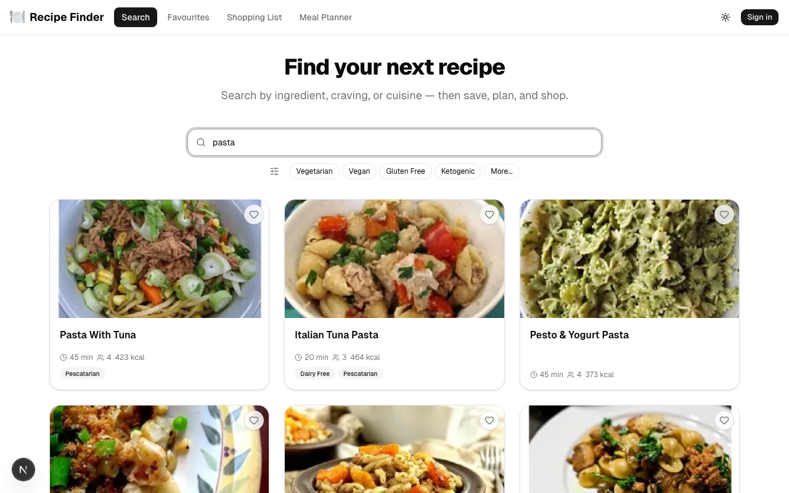
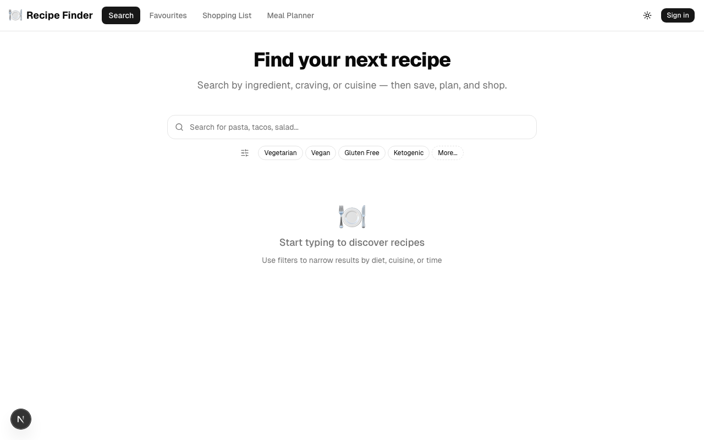
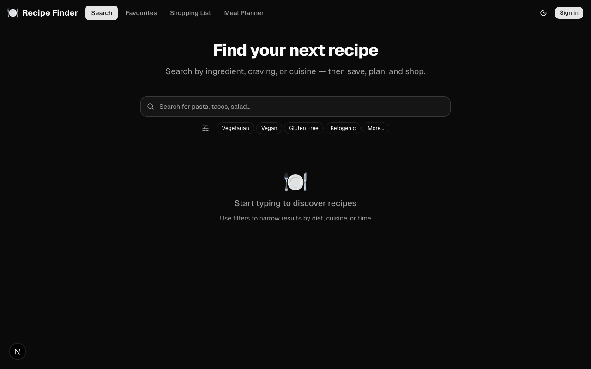
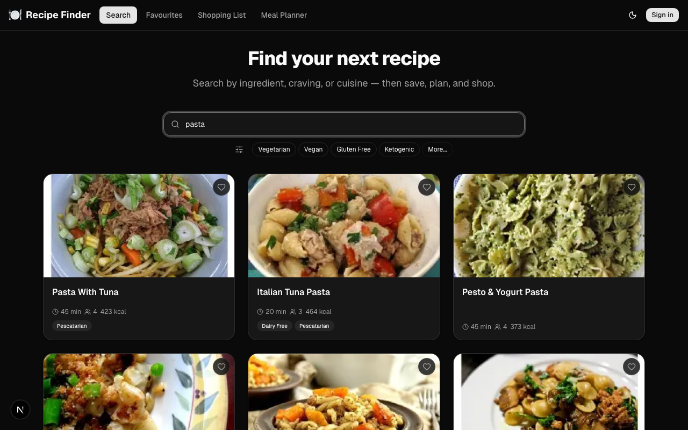
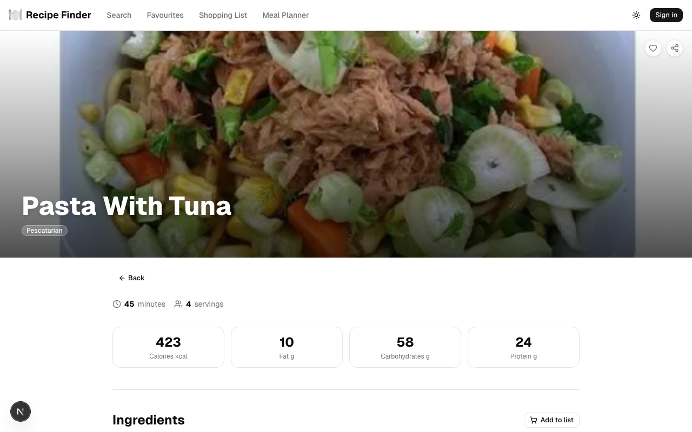
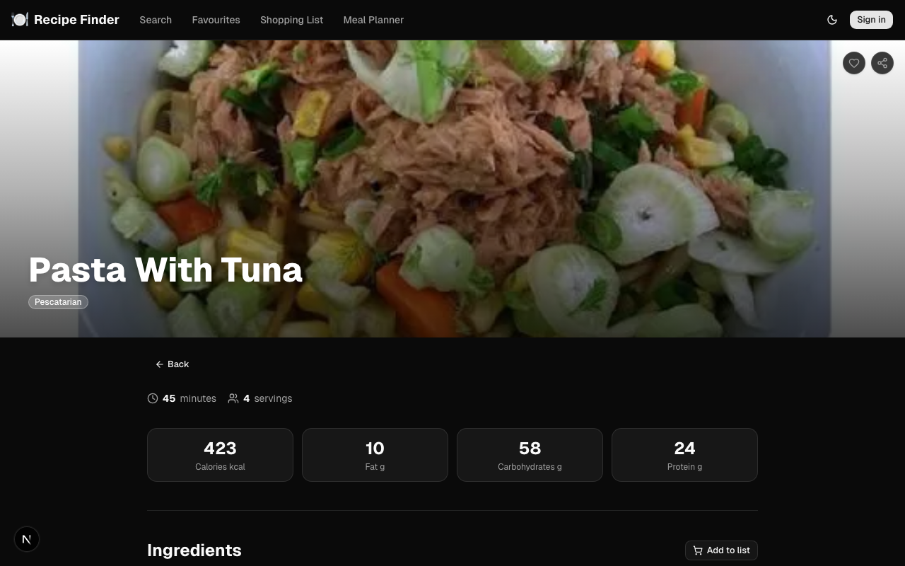
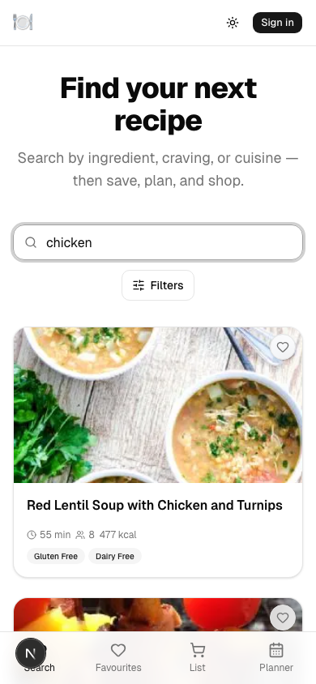
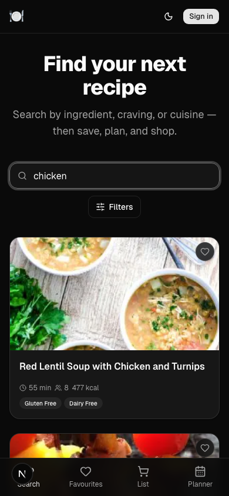
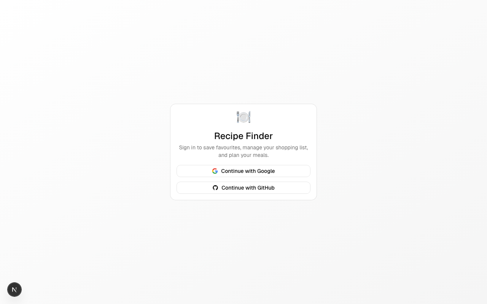

# Recipe Finder

A full-featured, mobile-first recipe app. Search millions of recipes, save favourites, build a shopping list, and plan your week with a drag-and-drop meal planner — all backed by a real database and OAuth authentication.



---

## Features

- **Recipe search** with filters for diet, cuisine, meal type, and max cook time
- **Nutrition info** — calories, protein, fat, and carbs per serving
- **Favourites** — save recipes with an optimistic heart toggle
- **Shopping list** — add all ingredients from any recipe in one tap, grouped by recipe with check-off
- **Meal planner** — drag-and-drop weekly calendar (breakfast / lunch / dinner / snack)
- **OAuth sign-in** — Google and GitHub, no passwords
- **Dark mode** — system-aware, persisted preference
- **Mobile-first** — bottom tab bar on small screens, full nav on desktop

---

## Screenshots

### Desktop

| Light | Dark |
|---|---|
|  |  |
|  |  |
|  |  |

### Mobile

| Light | Dark |
|---|---|
|  |  |

### Sign in



---

## Tech Stack

| Layer | Choice |
|---|---|
| Framework | Next.js 16 (App Router, Turbopack) |
| Auth | Auth.js v5 — Google + GitHub OAuth |
| Database | Neon Postgres + Prisma 6 |
| UI | shadcn/ui (Base UI) + Tailwind CSS 4 |
| Drag and drop | @dnd-kit/core + @dnd-kit/sortable |
| Recipes API | Spoonacular |
| Testing | Vitest + React Testing Library + Playwright |

---

## Getting Started

### 1. Clone and install

```bash
git clone https://github.com/RickBr0wn/recipe-finder.git
cd recipe-finder
npm install
```

### 2. Set up environment variables

```bash
cp .env.example .env
```

Fill in each value:

| Variable | Where to get it |
|---|---|
| `DATABASE_URL` | [neon.tech](https://neon.tech) — create a Postgres database |
| `AUTH_SECRET` | Run `npx auth secret` |
| `AUTH_GOOGLE_ID` / `AUTH_GOOGLE_SECRET` | [console.cloud.google.com](https://console.cloud.google.com) |
| `AUTH_GITHUB_ID` / `AUTH_GITHUB_SECRET` | [github.com/settings/applications/new](https://github.com/settings/applications/new) |
| `SPOONACULAR_KEY` | [spoonacular.com/food-api](https://spoonacular.com/food-api) |

### 3. Push the database schema

```bash
npx prisma db push
```

### 4. Run the dev server

```bash
npm run dev
```

Open [http://localhost:3000](http://localhost:3000).

---

## Scripts

```bash
npm run dev          # Dev server (Turbopack)
npm run build        # Production build
npm run test         # Vitest unit tests
npm run test:e2e     # Playwright E2E tests (requires dev server)
npm run lint         # ESLint
npx prisma studio    # Browse the database
```

---

## License

MIT
